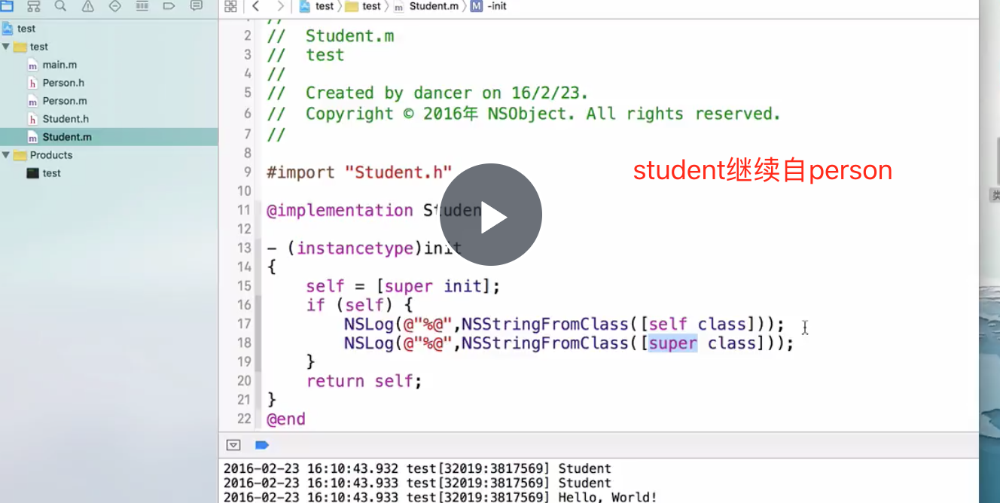
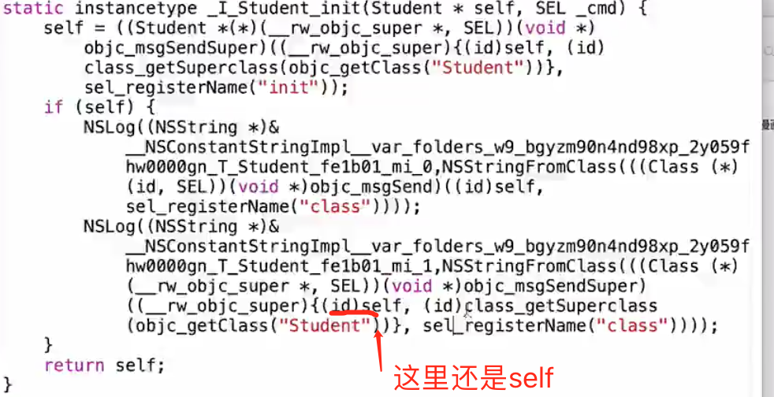
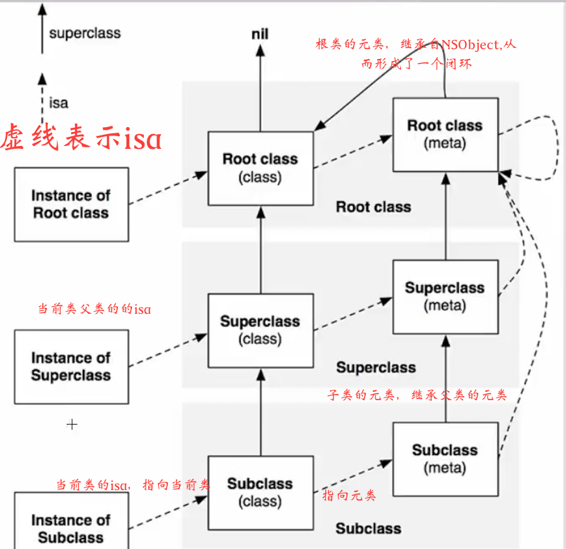
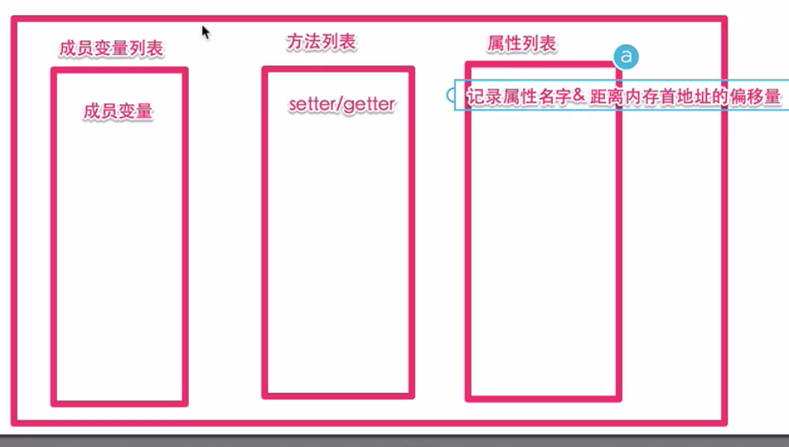
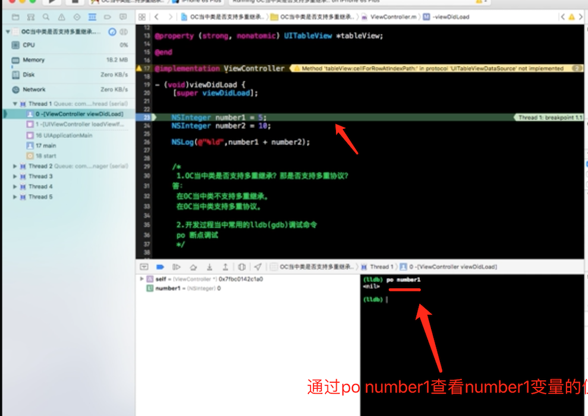
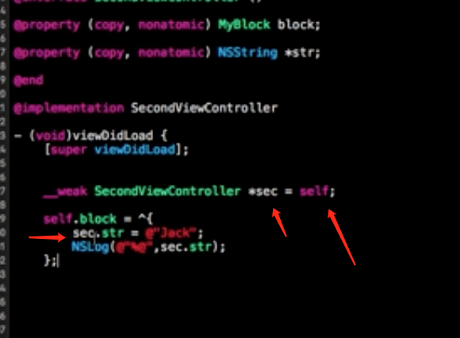

[iOS 开发者在面试过程中，常见的一些面试题，建议尽量弄懂了原理，并且多实践](https://github.com/liberalisman/iOS-InterviewQuestion-collection)

[常见iOS面试中考察的知识点整理](https://github.com/Alllfred/iOSReview)
[慕课网iOS面试实战项目总结：iOS面试题思维导图与回答](https://github.com/MisterBooo/ReadyForBAT)


####属性关键字
* strong、week的区别
	* strong、week在arc下针对对象的所有权，不能针对非对象；
	* strong强调指针是个强指针，持有对象的所有权。（如果有strong这个指针将持有对象的所有权）
	* week不持有对象的所有权。
* 什么时候应该持有对象的所有权？
* 什么时候使用week?
 * 我们在写委托的时候（避免循环引用），delgate一般用week指针来限定它
 * 在用storyboard搭建界面的时候，拖出来的控件都是用week声明的。（以button为例：控制器持有view,view持有button,如果view被动态移除了，控制器再持有button就没有意义了，所有控制器没有必须持有button的所有权（属性在控制器中，控制器拥有button的属性），交给view持有button的所有权即可）
 
* week与assign的区别
	* week只能修饰对象指针，assign可以修饰任意类型的指针
	* week指针指向对象如果被释放，week指针自动置为nil,assign不会自动置为nil
* 循环引用：
* copy关键字如何使用？
	* 使用block的时候，一般在方法或函数内使用block。block在站区分配内存，栈区的内存由操作系统管理，函数结束后就被释放掉。所以我们要先拷贝一份到堆区
	* NSString,NSArray,NSDictionary，因为它们存在对应的可变类型； 可变字符串 copy 将变为 不可变字符串。父类指针可以指向子类对象，我们不确定要指向（子类）是否为可变对象。而copy时，将会拷贝一份并持有；
* @property(copy)NSMutableArray *array;这个写法会有什么问题；
	* 首先要明白assain、atomic、readwrite默认就有 
	* copy最终得到都是一个不可变对象（可变、不可变->不可变）
	* mutablecopy最终得到是一个可变对象（可变、不可变->可变）
	* 所以这里用copy声明NSMutableArray，但其实得到是一个不可变的数组，不能对这个数组进行添加、删除操作；
	* atomic属于线程安全，会降低性能；在iOS开发中，一般用nonatomic就可以了
* self super
 
	* self
	* super 当前
	* 这里涉及到运行时机制，反编译出来的源码如下：
	 
     
* 一个objc对象如何进行内存布局？考虑有父类的情况
	* int类型占4字节，long占8字节
	* oc数据存储，交给成员变量处理。
	* 一个对象的内存，包括自己成员变量的内存，也包括父类成员变量的内存；	
	* 对象的方法。每一个对象都一有个class结构类型（描述了成员变量列表、内存大小、方法列表、协议列表）的isa指针，因此，内存中有一块用来存储isa指针。这个isa指针用来描述一个元类的存在，元类是用描述一个类的类。
	* 类用来描述对象，而元类是用来描述类对象。
	
* 一个objc对象的isa批指针指向什么？有什么作用？
	* 实例变量的isa指向它所属的类
	* 而类的的isa指针，指向它所属的元类
	* 而根类的isa指针，指向它本身。
	* 作用：当我们向一个对象发送消息的时候，oc这门语言会根据isa指针的指向去寻找元类里面的方法列表是否存在这个方法，进而响应。因此，isa主要用来帮助我们寻找方法、根类的方法；
* objc中类方法与实例方法有什么本质区别和联系？
	* 区别1：类方法属于类对象，而实例方法属于实例对象；
	* 区别2：类方法通过类对象调用，而实例方法通过实例对象调用；
	* 区别3：类方法中，self表示类对象；而在实例方法中，self表示实例对象；（self是什么）
	* 区别4：类方法里不可以访问成员变量；而实例方法可以；（是否可以访问成员变量）
	* 区别5：类方法里面可以调用实例方法，也可以调用类方法；而在实例方法既可以调用实例方法也可以调用类方法。（方法调用）

* @property的本质是什么？iavr(实例变量）、getter、setter是如何生成并添加到这个类中的。
	* 成员变量与属性的区别：属性是为成员变量服务的，当我们成员变量比较多的时候，我们就要写很多set get方法，所以我们用属性去生成get set方法，属性减化了代码量；
	* 本质：@property = ivar + getter + setter;
	* 添加一个属性的时候，会自动生成对应的成员变量，并添加到在员变量列表，且会生成set get 方法，并添加到方法列表。属性列表记录了距离内存首地址的你偏移量，通过它可以找到成员变量，调用对应的方法。
  
* @protocol和category中如何使用@property？	
	* 	在 protocol 中使用 property 只会生成 setter 和 getter 方法声明，我们使用属性的目的,是希望遵守这个协议的对象能实现该属性；
	*  category 使用 @property 也是只会生成 setter 和 getter 方法的声明,如果我们真的需要给category增加属性的实现（category并不能为这个类添加set get的实现，但是我们可以通过这种方法在category中@property来声明类中的私有属性，从而把私有属性公开化），需要借助于运行时的两个函数：
	
	```
	objc_setAssociatedObject//给属性set值
	objc_getAssociatedObject//get属性值
	```
* 浅复制与深复制的区别？
	* 浅复制是指针的复制，复制后新指针指向原来的对象；
	* 深复制是对对象内容的拷贝，复制后得到一个与原来对象相同的新对象，不过内存地址不同。
* 类别(category)的作用？继承和类别在实现中有何区别？
	* category给现有类添加新方法，扩展原来的类；
	* [category可以创建私有方法的向前引用](https://blog.csdn.net/xubinlxb/article/details/52077877)（可以公开对象私有属性或方法）。
	* category可以把一些大的类做一个分散(比如一个类规定不超过1000行代码)。
	* [可以用category去实现非正式协议](https://blog.csdn.net/xubinlxb/article/details/52079149)
	* 区别：如果类别与类方法相同时，会优先调用类别中的方法；类别强调对原有类的扩展，而不能修改原有类，而继承则可以修改；类别强调方法扩展，而继承不但可以扩展方法，还能派生出一些新的属性；
* 我们说的obc是动态运行时语言是什么意思？
	* 多态机制，不同的对象响应相同方法的时候，可以有不同的实现。不同的对象，可以接受相同的消息，可以有不同的实现；
	* oc把编译的时间（推断类型的时间）延迟到运行时；
	
	``` 
	obj_sendMsg(id reciver,selector) 
	```
	 	
* 方法和选择器有何不同？
	*  方法是相对于对象来说的，包含名字和实现等。
	*  选择器是方法的一种存储方法（选择器其实就是方法名），可以通过选择器间接的调用方法.
* 解释一下懒汉模式（懒加载）
	*  当需要的时候再创建对象
	*  一般重写set方法来实现
	*  节省不必要的内存（资源）消耗
* frame与bround有什么不同？
	* 两者类型都一样，都是描述矩阵
	* 坐标系参考点不一样，frame参考父视图，bround是视图相对于视图本身的偏移量；
* whate is push notification?
	* 增加用户与应用的粘愁度
	* 实际开发中一般用第三方推送；
	* iOS网络推送、本地推送，比如闹钟为本地推送；
* 一个tableView是否可以关联两个不同的数据源？你会怎么处理？
	* talbeview的回调方法里面处理，通过回调好方法里面的tableview来判断。
  
  ```
	-(NSInteger)tableView:(UITableView *)tableView numberOfRowsInSection:(NSInteger)section
{

}
```
* 什么是序列化？
	* 归档：在开发中，避免不了要做本地存储；本地存储：归档、coredata、sqlite3、NSUserDefaults;
	* 归档 能过plist文件实现数据模型（分为系统自带(Foundation框架中的类)的对象类型、用户自定义的类型）的本地存储；自定义对象通过实现NSCoding协议的两个方法：
  
  ```
  - (void)encodeWithCoder:(NSCoder *)aCoder{
    [aCoder encodeObject:self.name forKey:@"name"];
}
- (nullable instancetype)initWithCoder:(NSCoder *)aDecoder // NS_DESIGNATED_INITIALIZER
{
    self.name = [aDecoder decodeObjectForKey:@"name"];
    return self;
}  
  ```
* 什么是安全释放？
	* arc下，一般都是用strong copy指针持有一个对象，当arc把一个对象释放掉后，这个指针可能为空，也可能指向其他地方的内存；因此，最好把指针置为nil;
* 解释一下响应链？
	* 响应链是cocoa touch事件传递的一个机制，它是从上往下进行传递（或子视图向父视图传递，一直传到window,再到app delegate,如果app delegate也不受理，将丢弃），任何一个环节被响应，它的传递将就会被中止；
* 处理大量图片如何避免内存溢出？ 
	使用 imageWithContentsOfFile 或 initWithContensOfFile 方法加载图片。
 ```
   imageNamed:最简单，最消耗内存，因为它会全部加载到缓存，当Image被释放以后，缓存并不会被释放
   imageWithContentsOfFile:自动释放池来管理图片的释放，释放更加延迟
   initWithContensOfFile:需要手动release
 ```
* 简述沙盒机制是什么？
	* 沙盒实际上是一个iOS做数据保存的，它的特点是安全；
	* 每一个应用程序都有一个属于自己的沙盒
	* 每一个应用程序只能访问自己的沙盒目录
	* 应用程序不能访问其他应用程序的目录

	```
	NSString *sandBoxPath = NSHomeDirectory();
   NSLog(@"%@",sandBoxPath);
    它包括三个文件夹：
    Documents:用于存放应用程序的固有文件，如配置消息、开机动画、背景音乐、图片。如果把下载的东西存在这个文件夹下，应用不能上架；
    Library: 用户缓存，会做本地化存储
    tmp:存放临时数据，退出后清空
	```
* strong copy或retain copy关键字的区别？
	*  strong 与 retain都属于浅复制；
	*  copy属于深复制，会指向一个新对象，新对象是从源对象中拷贝出来的；源对象更新后，新对象是不会更新的。对于字符串，允许在其他通过指针来修改的话，可以用strong;
* 解决tableView卡的问题？
	* 一般出现在加载大量的图片资源的时候；
	* 把网络图片做成异步请求（放到子线程中实现）；
	* 另外，加载数据很大，每一行的高度又不确定的时候。（可以优先请求所有行的高度，做成一个数组） 
* 利用socket建立网络连接的步骤？
	* 它是通信的基石；分为TCP UDP
	* TCP:一对一连接，稳定
	* UDP:一对多连接，单向，不稳定，效率高
	* 步骤：服务器先监听（循环等待）；客户端请求，指定连接的服务器；连接确认；

* 简述MVC设计模式的理解
 * 通常我们在设计应用程序时，通过会把对象全部捕捉出来
 * m:用来管理应用程序的行为
 * v:负责显示，如何把数据显示给用户
 * c:负责处理业务逻辑。用来控制对象、视图对象，它要考虑如何把模型数据展示在视图上；
* MVC如何通信？
* OC中类是否支持多重继承（一个类有多个父类）？那是否支持多重协议
	* 在OC当中，类不支持多重继承
	* 一个类可以实现多个协议（支持多重协议） 
* 开发过程中常用的gdb（lldb）调试命令?
	* po 断点调试查看变量的值，如：
	  
*  介绍一下懒加载？
	*  又叫懒人模式，延迟加载，在需要的时候才加载控件、属性。 
	* 优点：懒加载的实质就是get方法，它能提高整体代码的执行效率，并且能节约系统所占用的资源；我们不必把所有的创建对象的方法写在viewdidload方法当中，这样就能代码的可读性较强；懒加载降低了代码的关联性，降低了整体代码的耦合度。
* 你对单例如何理解？如何使用？
	* 单例模式又名Singleton pattern，单例设计模式
	* 通过使用单例模式可以保证一个系统中被当作单例类只有一个类，并且该实例易于外界访问，从而实现了对实例个数的控制，以些实现了控制并节约系统内存资源的目的。
	* 如果一个系统中的某个类的对象只能存在一个，那么可以考虑单例模式；
	* 单例模式只能有一个实例，并且必须从一个为人熟知的访问点（单例方法）对其进行访问。那么这个实例就称为单例对象；
	* 单例对象只能通过子类化进行扩展，并且扩展的对象不会被破坏“客户端”代码； 例如 [UIApplication sharedApplication]   
* 在gcd中队列中分为哪两种？
	* 在gcd当中，队列分为串行队列、并行队列两种；
	* 串行队列是主队列，其他所有除主队列之外的队列都是并行队列
	* 串行队列当中的任务是执行一个任务完毕后，下一个任务才开始执行
	* 并行队列当中的任务是一个任务开始执行后，下一个任务才会开始执行；
	* 并行队列要开启一个子线程，而不是在主线程当中； 
* 在使用block的时候，如果发生了循环引用，我们应该如何去处理？
	* block在作为属性被声明在类当中，并且采用了self.的持有方式赋值的时候，就容易发生循环引用；
	* 采用__week修饰block内部的类指针，可以避免block循环引用发生的问题；
   
   
*  _weak类型的属性是否需要在dealloc中置为nil?
	* 无论是什么样的week类型的属性，在ARC机制之下，我们不需要在    dealloc中对其置Nil,因为编译器会自动帮助我们处理week类型的属性。
	* iOS面试题_上传应用
* isKindOfClass与isMemberOfClass的区别？
	* 都是NSObject的比较Class的方法.（相同点）
	* isKindOfClass:确定一个对象是否是一个类的成员,或者是派生自该类的成员.
	* isMemberOfClass:确定一个对象是否是当前类的成员.

* Runnloop相关

````		
讲讲 RunLoop，项目中有用到吗？
    控制线程生命周期（线程保活）
    解决NSTimer在滑动时停止工作的问题
    监控应用卡顿 https://www.2cto.com/kf/201707/653865.html
    性能优化

runloop内部实现逻辑？

runloop和线程的关系？ https://www.colabug.com/2855239.html
     1,每条线程都有唯一的一个与之对应的RunLoop对象
     2,RunLoop保存在一个全局的Dictionary里，线程作为key，RunLoop作为value
     3,线程刚创建时并没有RunLoop对象，RunLoop会在第一次获取它时创建
     4,RunLoop会在线程结束时销毁
     5,主线程的RunLoop已经自动获取（创建），子线程默认没有开启RunLoop

timer 与 runloop 的关系？https://www.aliyun.com/jiaocheng/359241.html
     iOS中默认开启的就是main函数里边的那个主线程runloop,iOS所有程序得以正产运行就是靠这个,
     所以当你开启nstimer的时候默认是可以运行的,因为默认会把nstimer添加到主线程
 
 
程序中添加每3秒响应一次的NSTimer，当拖动tableview时timer可能无法响应要怎么解决？//https://blog.csdn.net/qq_33777090/article/details/78631304
    在tableview滑动时timer就是显示暂停，原因是timer的这个简便构造方法把timer加入了NSRunLoopDefaultMode上，
    而tableview在滑动时只会处理UITrackingRunLoopMode，RunLoop并没有处理timer事件。
    解决的办法是将timer绑定到NSRunLoopCommonModes
 
 
runloop 是怎么响应用户操作的， 具体流程是什么样的？

说说runLoop的几种状态
 
runloop的mode作用是什么？
     model 主要是用来指定事件在运行循环中的优先级的，用来控制一些特殊操作只能在指定模式下运行,
     一般可以通过指定操作的运行mode 来控制执行时机
     目前已知的Mode有5种
     kCFRunLoopDefaultMode：App的默认Mode，通常主线程是在这个Mode下运行
     UITrackingRunLoopMode：界面跟踪 Mode，用于 ScrollView 追踪触摸滑动，保证界面滑动时不受其他 Mode 影响
     UIInitializationRunLoopMode：在刚启动 App 时进入的第一个 Mode，启动完成后就不再使用
     GSEventReceiveRunLoopMode：接受系统事件的内部 Mode，通常用不到
     kCFRunLoopCommonModes：这是一个占位用的Mode，不是一种真正的
 
     苹果公开提供的 Mode 有两个：
     NSDefaultRunLoopMode（kCFRunLoopDefaultMode）
     NSRunLoopCommonModes（kCFRunLoopCommonModes）
     
````

* Runtime

     
````
讲一下OC的消息机制
   OC中的方法调用其实都是转成了objc_msgSend函数的调用，给receiver（方法调用者）发送了一条消息（selector方法名）
   objc_msgSend底层有3大阶段:
   消息发送（当前类、父类中查找）、动态方法解析、消息转发
 
 
消息转发机制流程：https://blog.csdn.net/coyote1994/article/details/52454600

什么是Runtime？平时项目中有用过么？
   OC是一门动态性比较强的编程语言，允许很多操作推迟到程序运行时再进行
   OC的动态性就是由Runtime来支撑和实现的，Runtime是一套C语言的API，封装了很多动态性相关的函数
   平时编写的OC代码，底层都是转换成了Runtime API进行调用
   具体应用:
     利用关联对象（AssociatedObject）给分类添加属性
     遍历类的所有成员变量（修改textfield的占位文字颜色、字典转模型、自动归档解档）
     交换方法实现（交换系统的方法）
     利用消息转发机制解决方法找不到的异常问题
 
 在一个函数找不到时，Objective-C提供了三种方式去补救：
     1、调用resolveInstanceMethod给个机会让类添加这个实现这个函数
     2、调用forwardingTargetForSelector让别的对象去执行这个函数
     3、调用methodSignatureForSelector（函数符号制造器）和forwardInvocation（函数执行器）
       灵活的将目标函数以其他形式执行。
     
````

* [ios有哪些传值方式？](https://www.jianshu.com/p/3462e41d88d9)

````
属性传值、单例传值、代理传值、block传值、通知传值
````

* [ios如何删除栈中的某一个viewController?](https://blog.csdn.net/it_male/article/details/49931989)

* [多线程之iOS线程间通信？](https://www.jianshu.com/p/e0c0d43f9ab2)

````
- (void)performSelectorOnMainThread:(SEL)aSelector withObject:(id)arg waitUntilDone:(BOOL)wait;
- (void)performSelector:(SEL)aSelector onThread:(NSThread *)thr withObject:(id)arg waitUntilDone:(BOOL)wait;
````

* [gcd与nsoperationQueue的区别与联系？](https://www.jianshu.com/p/d09e2638eb27)

* [Application 的生命周期](https://www.jianshu.com/p/9f2c7e80b84b)
* [iOS常用的存储方式介绍](https://www.cnblogs.com/FBiOSBlog/p/5819418.html)   [IOS 对象的归档与解档](https://www.jianshu.com/p/3e08fa21316d)
* [ViewController的生命周期](https://blog.csdn.net/qijianli/article/details/7826979/)
