# 0712RunLoop

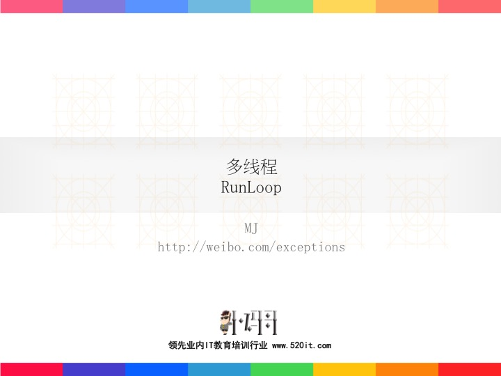

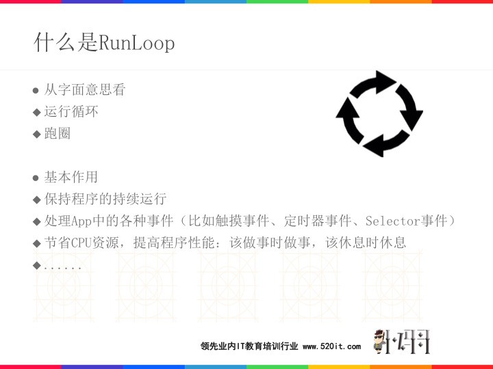

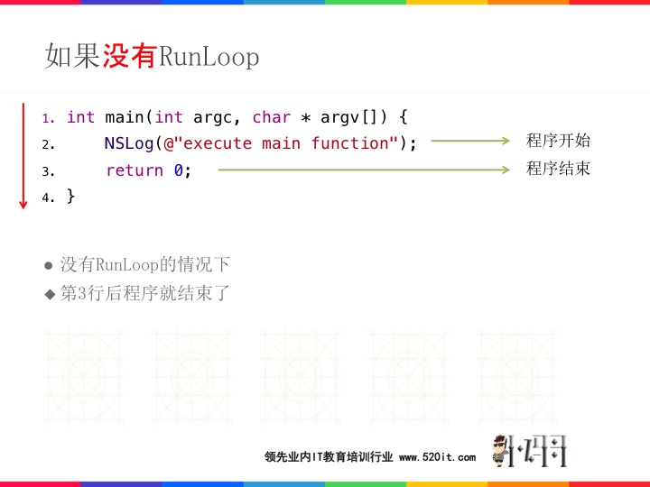

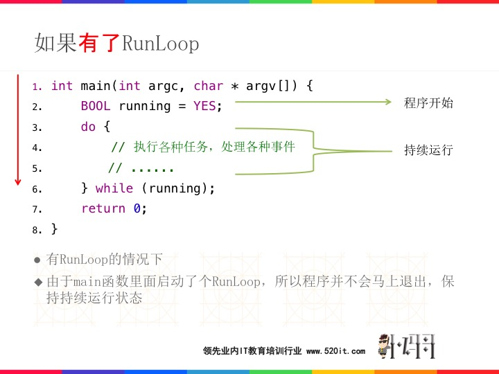

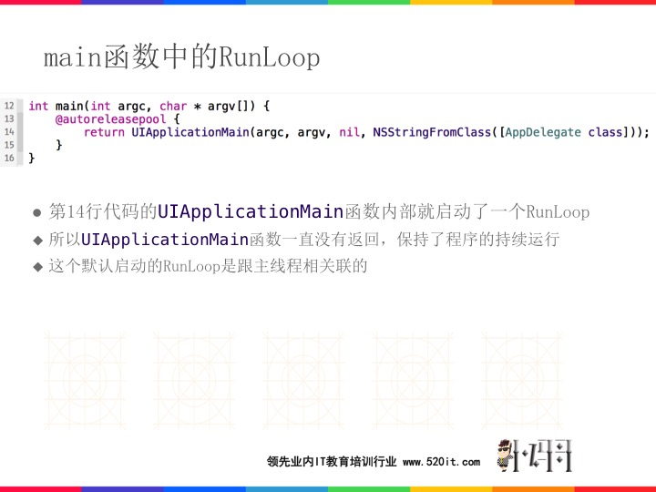

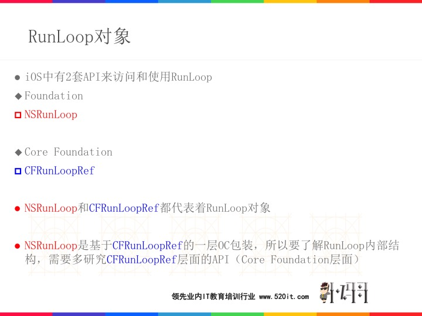

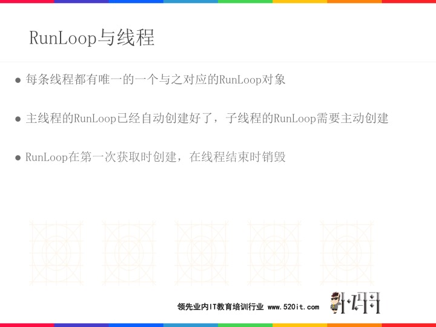


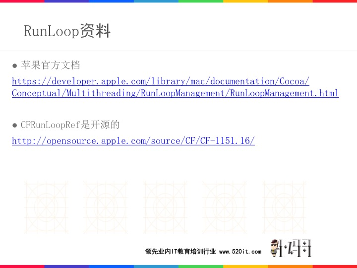

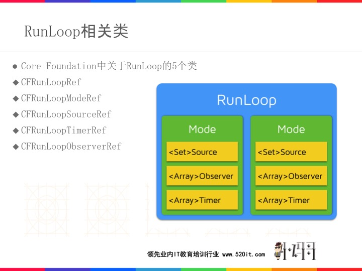

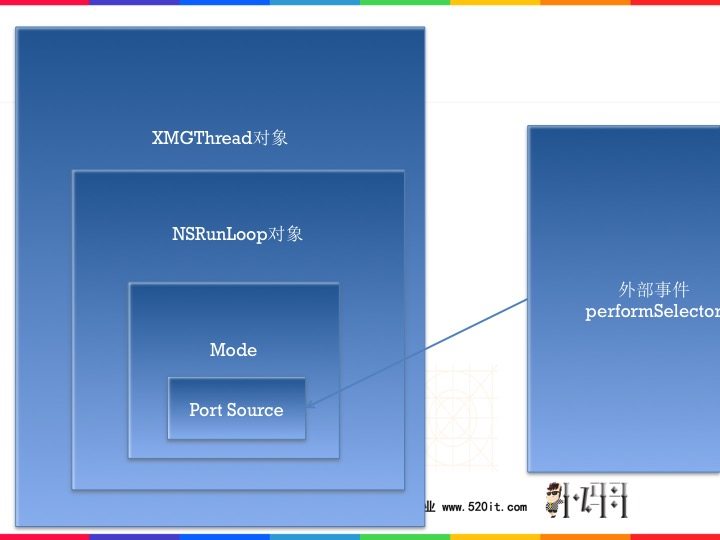

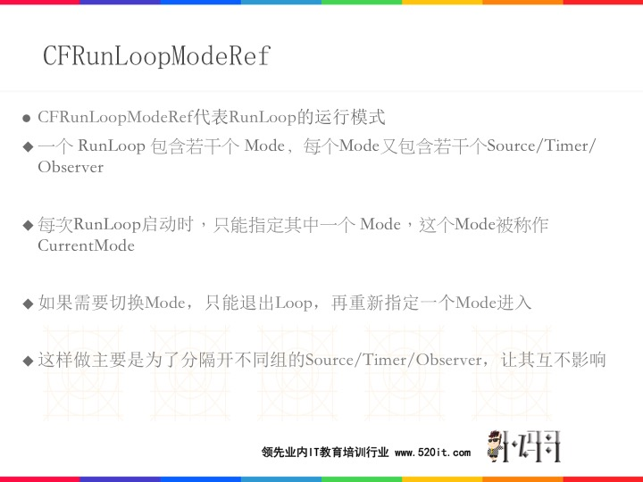

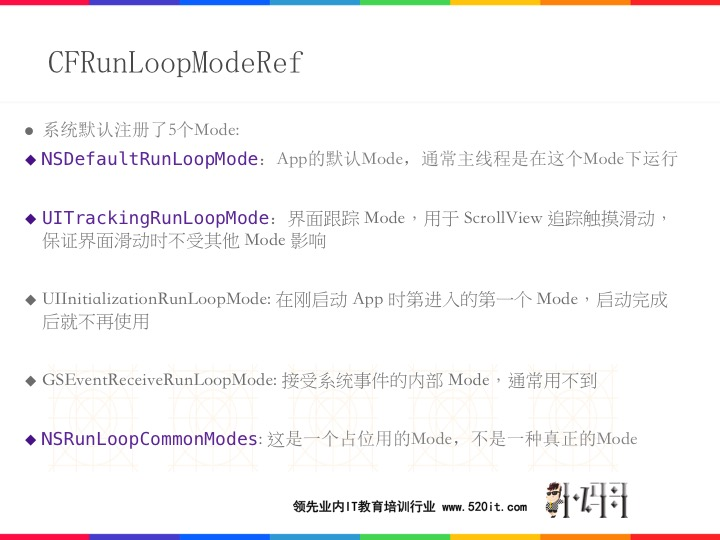


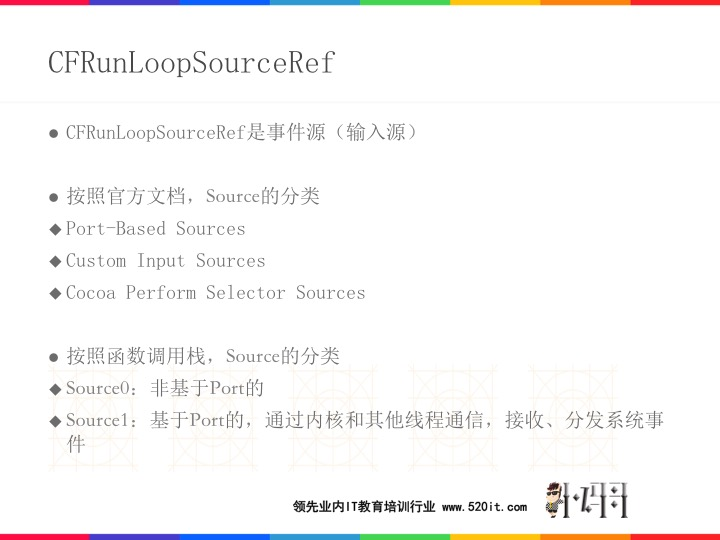

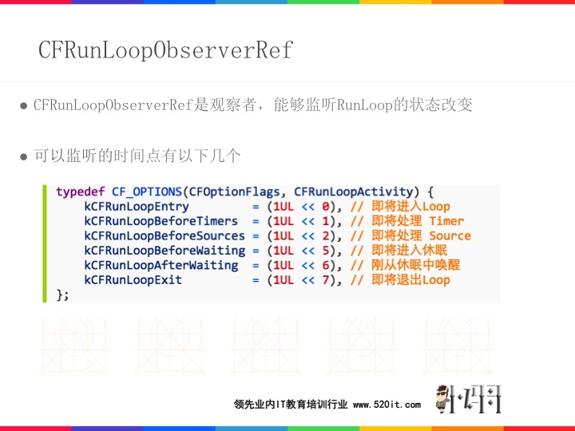

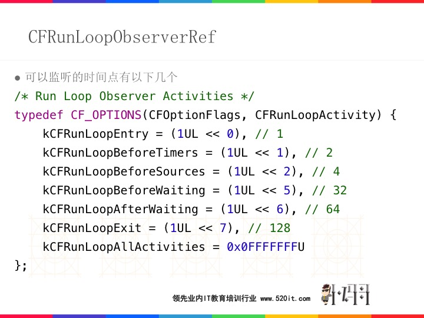

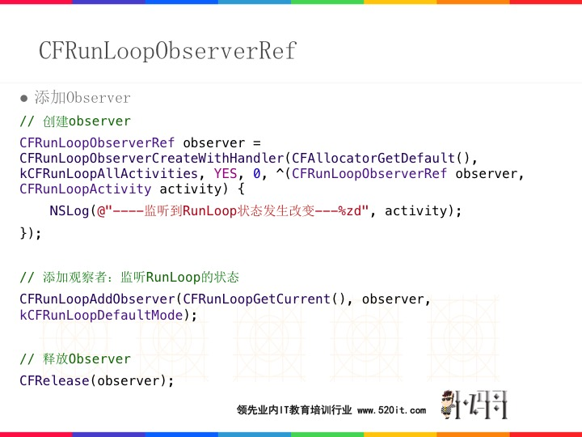

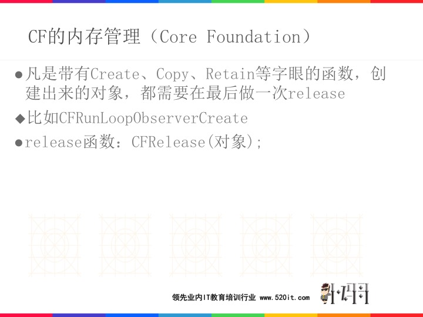

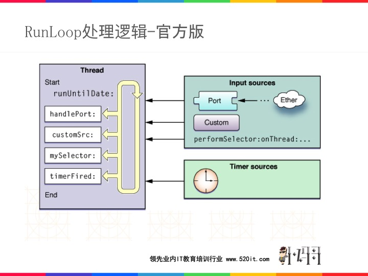

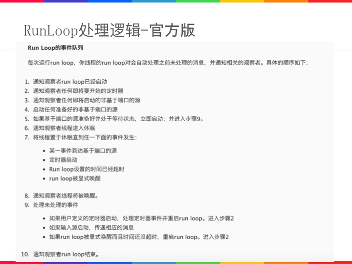

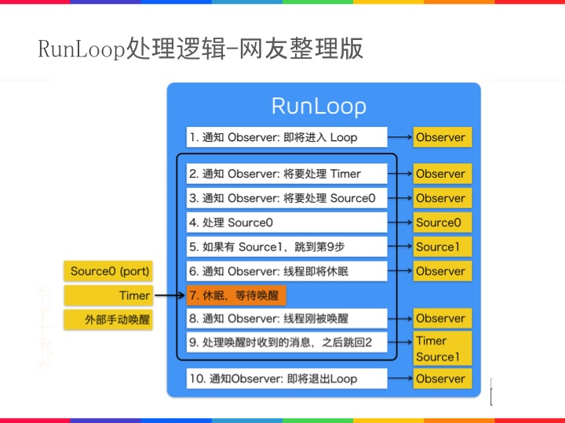

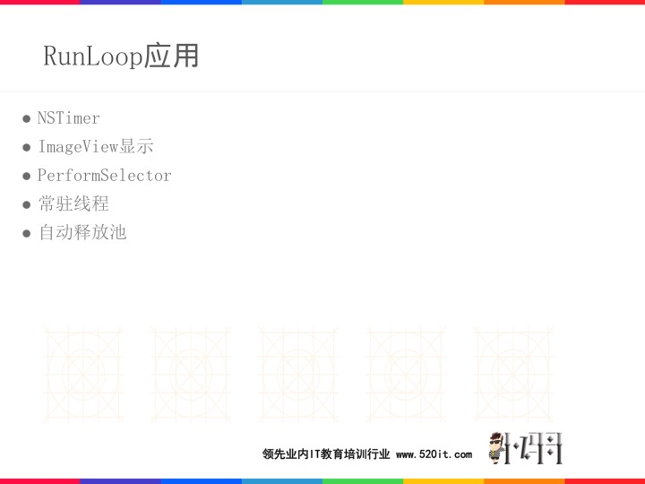

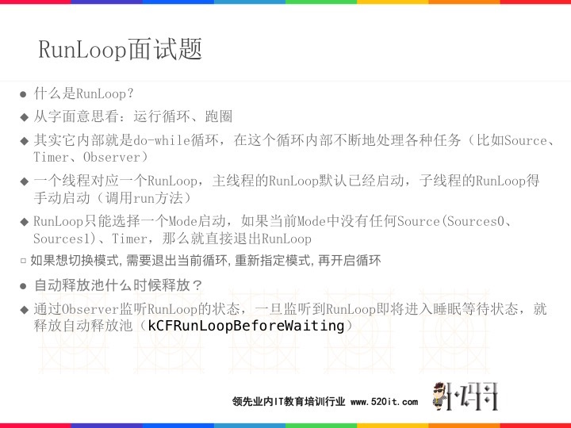

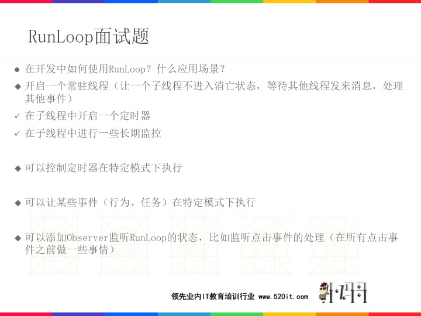

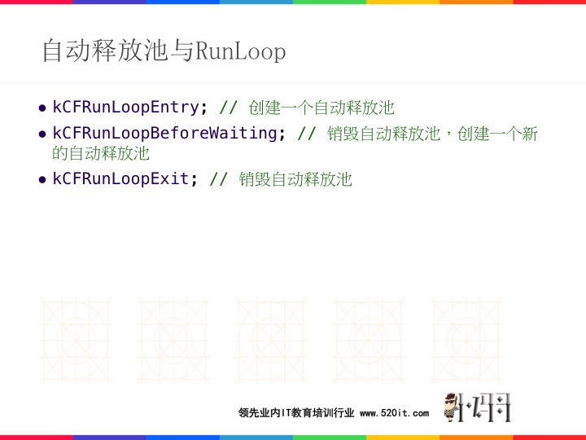

# RunLoop-codes
---
## 基础

```objc

    [[NSRunLoop currentRunLoop] runMode:NSRunLoopCommonModes beforeDate:[NSDate distantFuture]];

    //---------------------------------------
    [NSTimer scheduledTimerWithTimeInterval:2 target:self selector:@selector(run) userInfo:nil repeats:YES];

    NSTimer *timer = [NSTimer timerWithTimeInterval:2.0 target:self selector:@selector(run) userInfo:nil repeats:YES];

    //---------------------------------------
    //定时器只运行在NSDefaultRunLoopMode下，一旦RunLoop进入其他模式，这个定时器就不会工作
    [[NSRunLoop currentRunLoop] addTimer:timer forMode:NSDefaultRunLoopMode];
    //---------------------------------------
    // 定时器会跑在标记为common modes的模式下
    // 标记为common modes的模式：UITrackingRunLoopMode和kCFRunLoopDefaultMode
    [[NSRunLoop currentRunLoop] addTimer:timer forMode:NSRunLoopCommonModes];

    //---------------------------------------
    CFRunLoopGetCurrent();[NSRunLoop currentRunLoop];

    CFRunLoopGetMain();[NSRunLoop mainRunLoop];
    //---------------------------------------
    kCFRunLoopDefaultMode; NSDefaultRunLoopMode;

    UITrackingRunLoopMode;

    kCFRunLoopCommonModes; NSRunLoopCommonModes;

```

## timer

```objc

    NSTimer *timer = [NSTimer timerWithTimeInterval:2.0 target:self selector:@selector(run) userInfo:nil repeats:YES];

    //-------------------------------------------------------

    // 定时器只运行在NSDefaultRunLoopMode下，
    // 一旦RunLoop进入其他模式，这个定时器就不会工作
    [[NSRunLoop currentRunLoop] addTimer:timer forMode:NSDefaultRunLoopMode];

    //-------------------------------------------------------

    // 定时器只运行在UITrackingRunLoopMode下，一旦RunLoop进入其他模式，这个定时器就不会工作
    [[NSRunLoop currentRunLoop] addTimer:timer forMode:UITrackingRunLoopMode];

    //-------------------------------------------------------

    [[NSRunLoop currentRunLoop] addTimer:timer forMode:NSRunLoopCommonModes];

    //-------------------------------------------------------
    //-------------------------------------------------------


    // 调用了scheduledTimer返回的定时器，已经自动被添加到当前runLoop中，而且是NSDefaultRunLoopMode
    NSTimer *timer2 = [NSTimer scheduledTimerWithTimeInterval:2.0 target:self selector:@selector(run) userInfo:nil repeats:YES];

    // 修改模式
    [[NSRunLoop currentRunLoop] addTimer:timer2 forMode:NSRunLoopCommonModes];

```


## observer

```objc

    /*
     CFRunLoopObserverRef obj =
     CFRunLoopObserverCreateWithHandler(<#CFAllocatorRef allocator#>,
     <#CFOptionFlags activities#>,
     <#Boolean repeats#>,
     <#CFIndex order#>,
     <#^(CFRunLoopObserverRef observer, CFRunLoopActivity activity)block#>)
     */

    // 创建observer
    CFRunLoopObserverRef observer = CFRunLoopObserverCreateWithHandler(CFAllocatorGetDefault(),
    kCFRunLoopAllActivities, YES, 0, ^(CFRunLoopObserverRef observer, CFRunLoopActivity activity) {
        NSLog(@"----监听到RunLoop状态发生改变---%zd", activity);
    });

    // 添加观察者：监听RunLoop的状态
    CFRunLoopAddObserver(CFRunLoopGetCurrent(), observer, kCFRunLoopDefaultMode);

    // 释放Observer
    CFRelease(observer);

    /*
     CF的内存管理（Core Foundation）
     1.凡是带有Create、Copy、Retain等字眼的函数，创建出来的对象，都需要在最后做一次release
     * 比如CFRunLoopObserverCreate
     2.release函数：CFRelease(对象);
     */

```

## imageView-showMode

```objc

- (void)useImageView
{
    // 只在NSDefaultRunLoopMode模式下显示图片
    [self.imageView performSelector:@selector(setImage:) withObject:[UIImage imageNamed:@"placeholder"] afterDelay:3.0 inModes:@[NSDefaultRunLoopMode]];
}

```


## 怎么样常驻线程

```objc

- (void)viewDidLoad {
    [super viewDidLoad];

    self.thread = [[XMGThread alloc] initWithTarget:self selector:@selector(run) object:nil];
    [self.thread start];
}

- (void)run
{
    NSLog(@"----------run----%@", [NSThread currentThread]);

    while (1) {
        [[NSRunLoop currentRunLoop] run];
    }

    NSLog(@"---------");
}


- (void)run0
{
    NSLog(@"----------run----%@", [NSThread currentThread]);

    [[NSRunLoop currentRunLoop] addPort:[NSPort port] forMode:NSDefaultRunLoopMode];

    [[NSRunLoop currentRunLoop] run];

//    [[NSRunLoop currentRunLoop] runMode:NSDefaultRunLoopMode beforeDate:[NSDate distantFuture]];
//    [[NSRunLoop currentRunLoop] runUntilDate:[NSDate distantFuture]];

    NSLog(@"---------");
}

- (void)touch
{
    NSLog(@"----------test----%@", [NSThread currentThread]);
}

- (void)touchesBegan:(NSSet *)touches withEvent:(UIEvent *)event
{
    [self performSelector:@selector(touch) onThread:self.thread withObject:nil waitUntilDone:NO];
}

```

## timer和常驻线程

```objc

- (void)viewDidLoad {
    [super viewDidLoad];

    NSThread *thread = [[NSThread alloc] initWithTarget:self selector:@selector(timer1) object:nil];
    self.thread = thread;

    [thread start];
}
- (void)timer1
{
    NSTimer *timer = [NSTimer timerWithTimeInterval:1.0 target:self selector:@selector(test) userInfo:nil repeats:YES];

    [NSRunLoop.currentRunLoop addTimer:timer forMode:NSDefaultRunLoopMode];
    [NSRunLoop.currentRunLoop run];
}

- (void)timer0
{
    [NSTimer scheduledTimerWithTimeInterval:1.0 target:self selector:@selector(test) userInfo:nil repeats:YES];

    [NSRunLoop.currentRunLoop run];
}

- (void)test
{
    NSLog(@"----%@---", [NSThread currentThread]);
}

- (void)touch
{
    NSLog(@"----%@-+++++--", [NSThread currentThread]);
}

- (void)touchesBegan:(NSSet<UITouch *> *)touches withEvent:(UIEvent *)event
{
    [self performSelector:@selector(touch) onThread:self.thread withObject:nil waitUntilDone:NO];
}


```

## dispatch and timer

```objc

    // 获得队列
//    dispatch_queue_t queue = dispatch_get_global_queue(0, 0);
    dispatch_queue_t queue = dispatch_get_main_queue();

    // 创建一个定时器(dispatch_source_t本质还是个OC对象)
    self.timer = dispatch_source_create(DISPATCH_SOURCE_TYPE_TIMER, 0, 0, queue);

    // 设置定时器的各种属性（几时开始任务，每隔多长时间执行一次）
    // GCD的时间参数，一般是纳秒（1秒 == 10的9次方纳秒）
    // 何时开始执行第一个任务
    // dispatch_time(DISPATCH_TIME_NOW, 1.0 * NSEC_PER_SEC) 比当前时间晚3秒
    dispatch_time_t start = dispatch_time(DISPATCH_TIME_NOW, (int64_t)(1.0 * NSEC_PER_SEC));
    uint64_t interval = (uint64_t)(1.0 * NSEC_PER_SEC);
    dispatch_source_set_timer(self.timer, start, interval, 0);

    // 设置回调
    dispatch_source_set_event_handler(self.timer, ^{
        NSLog(@"------------%@", [NSThread currentThread]);
        count++;

//        if (count == 4) {
//            // 取消定时器
//            dispatch_cancel(self.timer);
//            self.timer = nil;
//        }
    });

    // 启动定时器
    dispatch_resume(self.timer);

```

